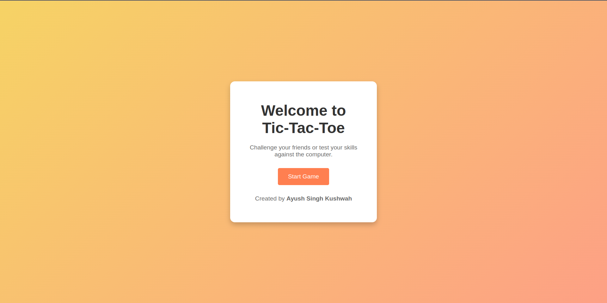

# Go Web Application

This is a simple web application written in Go (Golang) using the `net/http` package to handle HTTP requests.

## Running the Server

To start the server, follow these steps:

1. **Navigate to the project directory**:

   ```bash
   cd path/to/your/project
   ```

2. **Run the server**:

   ```bash
   go run main.go
   ```

   The server will start on port 8080 by default.

3. **Access the application**:

   Open your web browser and go to:
   [http://localhost:8080](http://localhost:8080)

## What It Looks Like

Here's a preview of the website:



## Project Structure

- `main.go`: The main application file where the HTTP server is defined.
- `static/`: Directory for static files like images, CSS, and JavaScript.
- `static/images/`: Contains image files used in the project.

## Additional Information

- Ensure that you have Go installed on your machine. You can download it from [the official Go website](https://golang.org/dl/).

### Thank you!!
